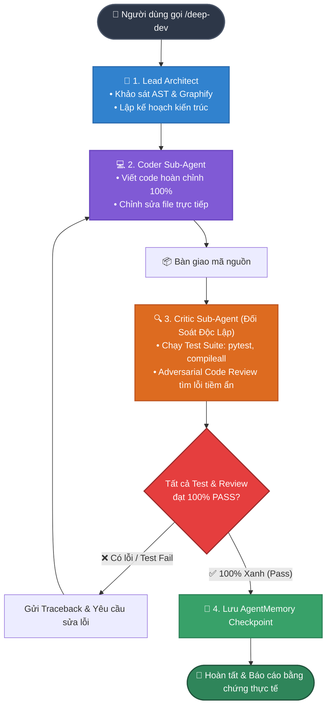

# Gemini Deep Dev (v0.3.0)

**Bộ khung thực thi lập trình sâu tốc độ cao (Boosted Deep Dev Engine - Dual-Agent Edition) phân tách độc lập luồng Thực thi (Coder) và Đối soát (Critic) cho Google Gemini trong Antigravity IDE.**

---

## 🎯 Vấn đề giải quyết

Dòng mô hình **Gemini Flash 3.*** có tốc độ cực nhanh và cửa sổ ngữ cảnh lớn, nhưng khi lập trình tự do thường gặp phải các vấn đề:
1. **Báo PASS ảo (Fake PASS)**: Khẳng định đã làm xong hoặc đã fix lỗi nhưng thực tế chưa chạy lệnh test/compiler nào.
2. **Lười biếng (Placeholder Syndrome)**: Tự động rút gọn code bằng `// TODO`, `/* code giữ nguyên */`, `...`, `pass`.
3. **Loãng ngữ cảnh & Điểm mù (Attention Dispersion & Blind Spots)**: Tự viết code rồi tự đánh giá dễ dẫn đến tự thỏa hiệp, bỏ sót các lỗi logic và edge cases.

**Gemini Deep Dev (v0.3.0 - Dual-Agent Edition)** ra đời để giải quyết triệt để vấn đề này bằng kiến trúc phân tách độc lập: **Lead Architect (Quy hoạch)** + **Coder Sub-Agent (Thực thi 100%)** + **Critic Sub-Agent (Đối soát & Thẩm định độc lập)**.

---

## ⚙️ Cơ chế hoạt động (Triad Architecture)



---

## 🚀 Tính năng nổi bật trong bản v0.3.0 (Dual-Agent Edition)

- **Phân tách Thực thi & Đối soát (Coder vs Critic)**: Coder tập trung viết mã nguồn chất lượng cao, Critic độc lập chạy test và phản biện đối nghịch tìm lỗi.
- **Frictionless & Boosted**: Hoạt động trực tiếp không bị tắc luồng, không rào cản ticket hay proposal JSON rườm rà.
- **Zero-Evidence = Failure**: Cấm tuyệt đối việc báo cáo hoàn thành nếu không có stdout thực tế từ Terminal Runner.
- **Tự động chữa lành (Self-Healing Loop)**: Tự đọc traceback lỗi khi test fail và tự động sửa đến khi vượt qua toàn bộ test suite (tối đa 3 vòng lặp).
- **AgentMemory Checkpoints**: Tự động lưu bài học và tiến độ vào hệ thống AgentMemory sau mỗi mốc quan trọng được Critic thông qua.

---

## 📦 Cài đặt

1. Đóng hoàn toàn Antigravity IDE.
2. Mở PowerShell và chạy:

```powershell
git clone https://github.com/Nakazasen/gemini-deep-dev.git
Set-Location .\gemini-deep-dev
.\tools\Install-DeepDev.ps1
```

3. Mở lại Antigravity IDE. Bộ công cụ sẽ tự động tích hợp vào hệ thống (`skills`, `hooks`, `mcp`).

---

## 💡 Hướng dẫn sử dụng

### 1. Dùng hằng ngày
- Hỏi đáp, đọc hiểu mã nguồn, phân tích lỗi: Sử dụng Gemini như bình thường.
- Sửa code nhanh: Gemini sẽ tự động dùng atomic diff và chạy test kiểm chứng.

### 2. Khi cần phát triển tính năng sâu hoặc sửa lỗi phức tạp
Gõ lệnh **`/deep-dev`** kèm yêu cầu:

```text
/deep-dev
Thêm middleware xác thực JWT và bảo vệ các private routes. Chạy test suite để kiểm chứng trước khi hoàn thành.
```

- **Coder Sub-Agent** sẽ triển khai code hoàn chỉnh 100% (không placeholder).
- **Critic Sub-Agent** sẽ trực tiếp chạy test suite qua terminal, đối soát lỗi và yêu cầu sửa lại nếu có lỗi phát sinh.
- Toàn bộ kết quả và bằng chứng (stdout test runner) sẽ được báo cáo minh bạch và lưu vào **AgentMemory**.

---

## 🔄 Cơ chế tự động cập nhật

- Tính năng tự cập nhật được **bật mặc định**.
- Hệ thống tự động kiểm tra bản cập nhật mới nhất từ GitHub khi người dùng đăng nhập Windows (không yêu cầu quyền Administrator).
- Tự động đối soát mã băm SHA-256 trước khi áp dụng bản nâng cấp.

---

## 🛠️ Dành cho nhà phát triển

```powershell
# Chạy toàn bộ test suite
py -3 -m pytest tests
py -3 -m pytest bundle/deep-dev/scripts/test_deep_dev_security.py

# Đóng gói bản phát hành mới
.\tools\Build-Release.ps1
```

---

## 📄 Bản quyền

Phát hành dưới giấy phép MIT License. Bản quyền thuộc về [Nakazasen](https://github.com/Nakazasen).
