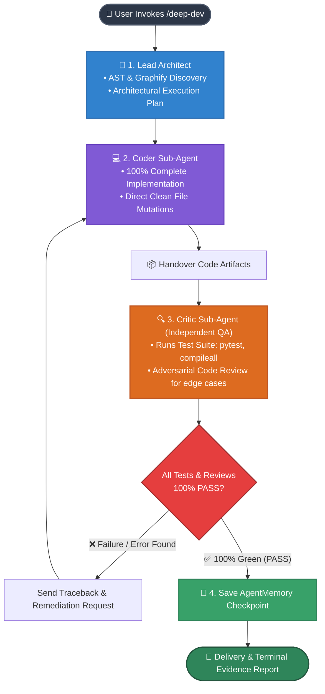

# Gemini Deep Dev (v0.3.0)

**A High-Performance Boosted Execution Engine (Dual-Agent Edition) separating Implementation and Verification for Google Gemini Flash in Antigravity IDE.**

---

## 🎯 Problems Solved

While **Google Gemini Flash 3.*** delivers industry-leading inference speed and a vast context window, autonomous coding workflows often suffer from predictable pitfalls:
1. **Hallucinated Verification (Fake PASS)**: Claiming fixes or implementations are complete without running actual test commands.
2. **Lazy Code & Placeholders**: Truncating code output with placeholders like `// TODO`, `/* unchanged code */`, `...`, or `pass`.
3. **Attention Dispersion & Blind Spots**: Self-reviewing one's own code often leads to confirmation bias and overlooked edge cases.

**Gemini Deep Dev (v0.3.0 - Dual-Agent Edition)** introduces strict role separation: **Lead Architect (Planning)** + **Coder Sub-Agent (100% Complete Implementation)** + **Critic Sub-Agent (Independent Test & Adversarial Review)**.

---

## ⚙️ Architecture & Execution Lifecycle (Triad Architecture)



---

## 🚀 Key Highlights in v0.3.0 (Dual-Agent Edition)

- **Strict Coder vs Critic Separation**: Coder focuses on flawless implementation while Critic conducts independent testing and adversarial code review.
- **Frictionless & Fast**: Direct execution without rigid ticket handshakes or blocking proposal serializations.
- **Zero-Evidence = Failure**: Never accepts a completion report unless backed by real terminal test receipts.
- **Autonomous Self-Healing**: Automatically reads failure tracebacks and iterates until all tests pass (up to 3 loops).
- **AgentMemory Checkpoints**: Persists verified milestone state to AgentMemory.

---

## 📦 Installation & Setup

1. Completely close Antigravity IDE.
2. Open PowerShell in the repository root and run:
```powershell
git clone https://github.com/Nakazasen/gemini-deep-dev.git
Set-Location .\gemini-deep-dev
.\tools\Install-DeepDev.ps1
```
3. Relaunch Antigravity IDE.

---

## 💡 Usage Guide

### 1. Daily Development
- Code exploration, refactoring, and debugging: Chat with Gemini as usual.

### 2. Deep Implementation & Bug Fixing
Invoke `/deep-dev` alongside your coding task:
```text
/deep-dev
Implement JWT authentication middleware and secure private routes. Run test suite to verify before completion.
```

- **Coder Sub-Agent** produces 100% complete, placeholder-free code.
- **Critic Sub-Agent** executes terminal tests, verifies logs, and prompts auto-fixes if errors arise.
- Verifiable receipts and progress milestones are persisted directly to **AgentMemory**.

---

## 📄 License & Author
- Author: **Nakazasen**
- Version: **v0.3.0**
- License: MIT License
